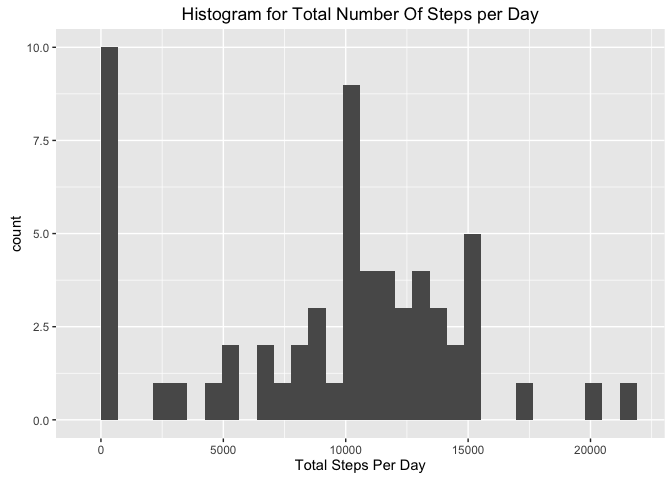
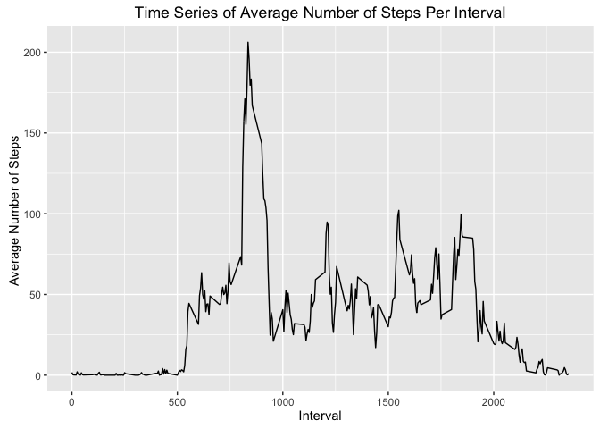
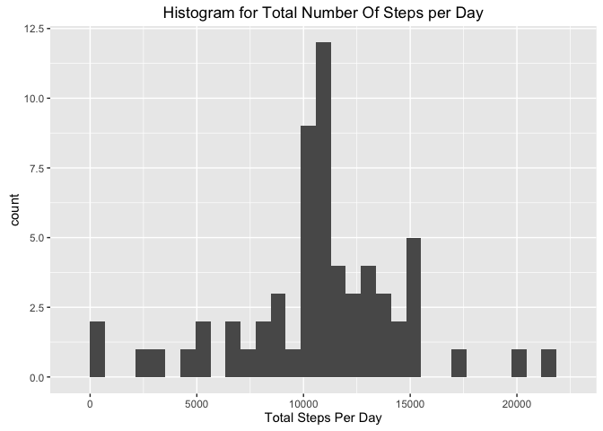
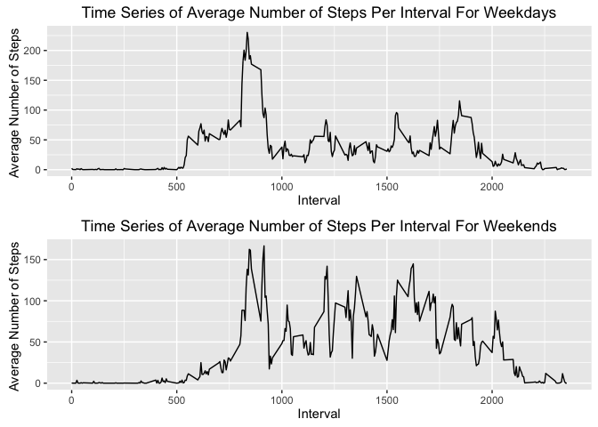

# Reproducible Research Project 1

## Introduction
It is now possible to collect a large amount of data about personal movement using activity monitoring devices such as a Fitbit, Nike Fuelband, or Jawbone Up. These type of devices are part of the “quantified self” movement – a group of enthusiasts who take measurements about themselves regularly to improve their health, to find patterns in their behavior, or because they are tech geeks. But these data remain under-utilized both because the raw data are hard to obtain and there is a lack of statistical methods and software for processing and interpreting the data.

We will explore and process the data. We will utilize the following libraries:
lubridate
ggplot2
gridExtra
### Data And Preprocessing
We downloaded the data from https://d396qusza40orc.cloudfront.net/repdata%2Fdata%2Factivity.zip.

We read in the activity data set using the code below:

```r
activityData <- read.csv("activity.csv", stringsAsFactors = F)
```
We made the decision to read the strings as factors in order to ease the conversion of using lubridate to process the date column which we do below.

```r
library(lubridate)
activityData$date <- ymd(activityData$date)
```

### Mean Total Number of Steps Taken per Day
In order to calculate the number of steps taken per day we must first analyze the range of the dates
which we do below.

```r
range(activityData$date)
```

```
## [1] "2012-10-01 UTC" "2012-11-30 UTC"
```
We notice that all the results occur in the year in the year 2012. Thus we do not need to process the data variable any further in order to find out how many steps were taken per day since each date is guaranteed to be unique. Thus, we sum the results by the date below.

```r
totalStepsPerDay <- tapply(activityData$steps, activityData$date, sum, na.rm=TRUE)
```
We plot the total number of steps per day as histogram which you can see below.

```r
library(ggplot2)
qplot(totalStepsPerDay, geom="histogram", 
      main="Histogram for Total Number Of Steps per Day",
      xlab="Total Steps Per Day"
      )
```

```
## `stat_bin()` using `bins = 30`. Pick better value with `binwidth`.
```



We calculate the Mean number of steps per day below:

```r
mean(totalStepsPerDay)
```

```
## [1] 9354.23
```

We calculate the Median number of steps per day below:

```r
median(totalStepsPerDay)
```

```
## [1] 10395
```

### Average Daily Activity Pattern
First we will calculate the mean number of steps per interval, since the intervals can be duplicated we are averaging across all days, which we accomplish below

```r
meanStepsPerInterval <- tapply(activityData$steps, activityData$interval, mean, na.rm=T)
```
We then plot the time series data below

```r
qplot(
    as.integer(rownames(meanStepsPerInterval)),
    meanStepsPerInterval, 
    geom = "path",
    main="Time Series of Average Number of Steps Per Interval",
    xlab="Interval",
    ylab="Average Number of Steps "
    )
```



We find the 5 minute interval in which the max average steps occurs with the code below

```r
which.max(meanStepsPerInterval)
```

```
## 835 
## 104
```
Notice there are two values. If we examine the values of those rows we will see which row it really is the value 835 refers to the row name and the 104 refers to the row index. Thus, the 4 minute interval at which the maximum average number of steps occurs is the 5 minute inveral 835 which occurs at row 104 in our list. We verify we have found the maximum with the code below.

```r
meanStepsPerInterval[104] == max(meanStepsPerInterval)
```

```
##  835 
## TRUE
```

### Imputing missing values
In order to impute missing values we must first check each column for NA values.
We run the code below to check how man NA values are contained in each column.

```r
nrow(activityData[is.na(activityData$date),])
```

```
## [1] 0
```

```r
nrow(activityData[is.na(activityData$interval),])
```

```
## [1] 0
```

```r
nrow(activityData[is.na(activityData$steps),])
```

```
## [1] 2304
```
We find that the date and interval columns contain no NA values and the steps column contains 2304 rows that have NA as the value for step. We will set the value of steps to be the average number of steps for that row's particular interval which we accomplish below.

```r
activityData[is.na(activityData$steps),1] <- meanStepsPerInterval[as.character(activityData[is.na(activityData$steps),3])]
```
Now to compare the results of our imputation to the results generated in the *Mean Total Number of Steps Taken per Day* section as seen below

```r
totalStepsPerDayImputed <- tapply(activityData$steps, activityData$date, sum)
qplot(totalStepsPerDayImputed, geom="histogram", 
      main="Histogram for Total Number Of Steps per Day",
      xlab="Total Steps Per Day"
      )
```

```
## `stat_bin()` using `bins = 30`. Pick better value with `binwidth`.
```



We notice the number of days with zero steps has decreased due to the fact more days now have steps due to the imputation. For further analysis we calculate the mean and median as we do below.

```r
mean(totalStepsPerDayImputed)
```

```
## [1] 10766.19
```

```r
median(totalStepsPerDayImputed)
```

```
## [1] 10766.19
```
We now find the mean and median are equal and have larger values than both the mean and median from *Mean Total Number of Steps Taken per Day* which implies that imputing the data has increased the average steps per day.

### Activity Patterns between Weekdays and Weekends
In order to analyze the differences between Weekdays and Weekends we must add that data to our dataset which we do below.

```r
activityData$part_of_week <- "Weekday"
activityData[weekdays(activityData$date) %in% c("Sunday", "Saturday"),4] <- "Weekend"
activityData <- transform(activityData, part_of_week = as.factor(part_of_week))
```
Then we plot each graph

```r
library(gridExtra)

activityDataWeekday <- subset(activityData, part_of_week=="Weekday")
meanStepsPerIntervalWeekday <- tapply(activityDataWeekday$steps, activityDataWeekday$interval, mean)
plot1 <- qplot(
    as.integer(rownames(meanStepsPerIntervalWeekday)),
    meanStepsPerIntervalWeekday, 
    geom = "path",
    main="Time Series of Average Number of Steps Per Interval For Weekdays",
    xlab="Interval",
    ylab="Average Number of Steps "
    )

activityDataWeekend <- subset(activityData, part_of_week=="Weekend")
meanStepsPerIntervalWeekend <- tapply(activityDataWeekend$steps, activityDataWeekend$interval, mean)
plot2 <- qplot(
    as.integer(rownames(meanStepsPerIntervalWeekend)),
    meanStepsPerIntervalWeekend, 
    geom = "path",
    main="Time Series of Average Number of Steps Per Interval For Weekends",
    xlab="Interval",
    ylab="Average Number of Steps "
    )
grid.arrange(plot1, plot2, ncol=1)
```


